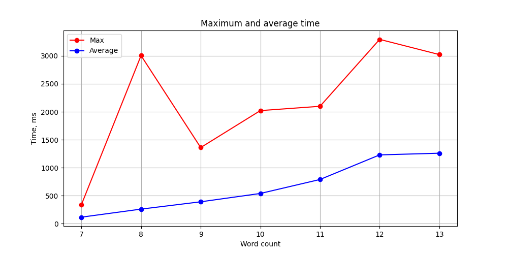
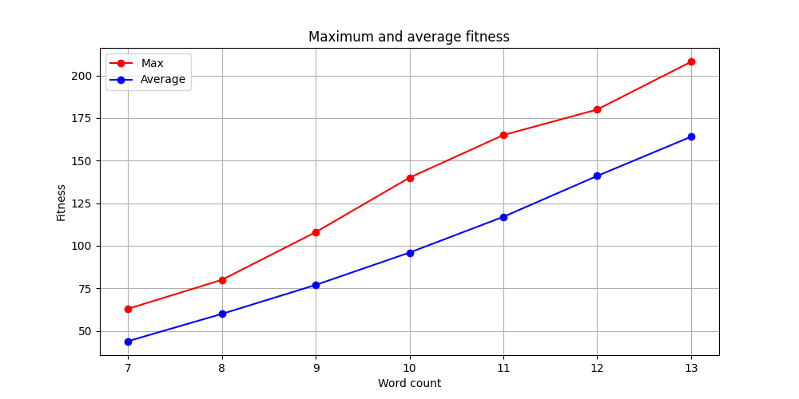

## Semantics

**Evolutionary algorithms (EA)** simulate natural selection, including the
mechanisms of mutation, crossover, and selection. The initial population of
solutions is subjected to change and selection over several generations until an
optimal or near-optimal solution to the problem is reached.

> This solution belongs to a subset of EA, namely **genetic algorithms**.

The gene is represented by the intersection of two words. Furthermore, an
individual's genome is a set of genes, i.e., the intersections of words on the
grid of a particular crossword puzzle combination.

When we try to extend the genome by adding a single gene, we may actually be
adding multiple genes at once, since a new word may trigger multiple
intersections with other words at once.

When we try to shrink a genome by deleting one gene, we may actually be deleting
several genes at once, since deleting one intersection (two words) may trigger
the deletion of several intersections with other words at once. Moreover, genome
shrinkage can produce _islands_ of genes that must be split into new
individuals.

## Evolutionary flow

At the beginning of the crossword generation, the algorithm looks for all
possible intersections (genes) between the given words. Then, it creates an
initial population whose individuals consist of only one of the genes found.

Once an initial population is created, evolution begins. Evolution includes 4
key components: crossover, mutation, validation, fitness.

The crossover involves two representatives of the population: the alpha parent
and the beta parent. The alpha parent is the best representative of the previous
generation, the beta parent is all other representatives of the previous
generation. The crossover does **NOT** produce offspring, it simply saturates
the mother's genome (beta's genome) with the father's genes (alpha's genome).
This is done to speed up the process of evolution.

There are two types of mutation:

- **genome extension** - the addition of a new gene to the genome;

- **genome shrinkage** - the deletion of a gene from the genome.

Each type of mutation has a probability of occurring. In addition, genome
shrinkage can trigger the creation of gene islands, so that after each mutation,
**NOT** a beta parent is added to the population, but its islands (offspring).

After each evolution, the population is sorted according to the fitness of the
individual, i.e. the product of the current number of words and genes in the
individual.

A population evolves until a predicate appears in it. Or until the population
has **NOT** degenerated.

## Benchmark

To analyze the algorithm's performance statistically, 100 random input files
were generated (see [testdata](./testdata/) folder). The distribution of the
number of words in the input file is shown in the following figure:

| Word count | Amount of files |
| ---------- | --------------- |
| 7          | 8               |
| 8          | 12              |
| 9          | 24              |
| 10         | 28              |
| 11         | 19              |
| 12         | 5               |
| 13         | 4               |

The tests were executed on [Ubuntu 22.04](https://releases.ubuntu.com/22.04/)
using [Python 3.10.12](https://www.python.org/downloads/release/python-31012/).
A total of 6000 runs were performed, i.e. 60 runs for each of the 100 test
inputs (see [testdata](./testdata/) folder). The results were saved to
[results.json](./benchmark/results.json) with the following model:

```python
class Status(str, Enum):
    """The status of the crossword generation."""

    OK = "ok"
    """The crossword was successfully generated."""
    DEGENERATED = "degenerated"
    """During the crossword generation, the population has degenerated."""


class SuccessLaunch(BaseModel):
    """The successful execution of crossword generation."""

    status: Status = Status.OK
    """The status of crossword generation."""
    time: int
    """The time of crossword generation."""
    fitness: int
    """The fitness of the generated crossword."""


class FailureLaunch(BaseModel):
    """The failed execution of crossword generation."""

    status: Status = Status.DEGENERATED
    """The status of crossword generation."""


Launch = SuccessLaunch | FailureLaunch
"""The instance of crossword generation launch."""


class SampleRange(BaseModel):
    """The range of the sample values."""

    min: int
    """The minimum value in the sample."""
    max: int
    """The maximum value in the sample."""


class SampleStat(BaseModel):
    """The statistical characteristics of the sample."""

    size: int
    """The number of representatives in the sample."""
    mean: int
    """The mean of the sample."""
    standard_deviation: int
    """The standard deviation of the sample."""
    range: SampleRange
    """The range of the sample."""


class LaunchStat(BaseModel):
    """The launch stats for crossword generation."""

    time: SampleStat
    """The time stats for successful launches."""
    fitness: SampleStat
    """The fitness stats for the launches."""
    setbacks: int
    """The amount of failures during the launches."""


class Benchmark(BaseModel):
    """Benchmark for crossword generation based on multiple runs of a
    given sample input file.
    """

    filename: str
    """The path to the input file."""

    words: int
    """The number of words in the input file."""
    genes: int
    """The total number of word intersections possible."""

    launches: list[Launch]
    """The launch list with execution information."""

    stats: LaunchStat
    """Stats based on the examined launches."""
```

**Note** that the following generation parameters were used for benchmarking:

| Constant Name                          | Description                                                    | Value           |
| -------------------------------------- | -------------------------------------------------------------- | --------------- |
| [WORD_PATTERN](./main.py#L18)          | Regular expression to assert a crossword word.                 | `^[a-z]{2,20}$` |
| [ROW_SIZE](./main.py#L21)              | Row size of the crossword grid.                                | `20`            |
| [COL_SIZE](./main.py#L23)              | Column size of the crossword grid.                             | `20`            |
| [MUTATION_ATTEMPTS](./main.py#L26)     | The number of attempts to mutate an individual.                | `10`            |
| [GENOME_EXTENSION_RATE](./main.py#L28) | The probability that a mutation will lead to genome expansion. | `0.5`           |
| [GENOME_SHRINKAGE_RATE](./main.py#L30) | The probability that a mutation will lead to genome shrinkage. | `0.15`          |
| [POPULATION_LIMIT](./main.py#L32)      | The maximum number of individuals in the population.           | `256`           |

## Results




